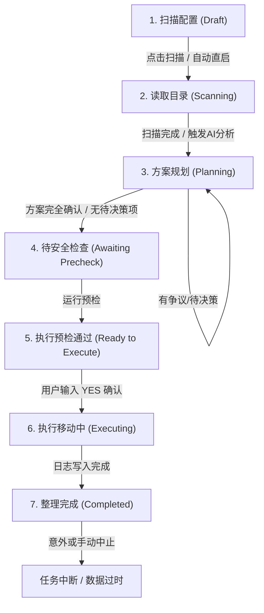

# 设计系统规范：桌面级建筑式工作台 (Desktop Architectural Workbench)

## 1. 设计总纲

### 核心定位

这不是一个营销网站，也不是一个“精致 SaaS 后台”。  
它是一款**本地文件整理桌面工具**，需要服务高频、长时段、以任务为中心的使用场景。

界面的首要职责不是“惊艳”，而是建立一种**稳定、可信、可持续工作的环境感**。

我们要的不是“网页式产品感”，而是：

- 像一个被严格整理过的桌面工作台
- 像一张有结构、有秩序的操作台
- 像一个让用户长时间停留也不会疲劳的工具环境

### 视觉论点 (Visual Thesis)

**冷静、精确、低装饰、低噪声。**  
界面应该像建筑平面图一样清晰，像高质量办公器具一样克制。

### 内容论点 (Content Plan for Product UI)

对于产品型页面，内容顺序固定为：

1. 当前上下文
2. 当前任务或当前记录
3. 结构化信息
4. 直接操作

不要出现网页式的 hero、宣传式导语、情绪型大段文案。

### 交互论点 (Interaction Thesis)

动效用于建立“结构感”，而不是建立“氛围感”。

推荐只保留 3 类动效：

- 面板切换时的短距离位移与淡入
- 列表选中与详情区更新的状态过渡
- 加载、思考、执行中的轻量脉冲与进度反馈

禁止用大面积漂浮、放大、发光、漂移感动效制造“网页展示感”。

### 应用层全局上下文同步契约 (Header Context Broadcast Protocol)

为了确保工作台在多路由、深层级交互中保持极高的“环境感”，系统约定使用基于 LocalStorage 事件的 Header 状态广播协议：
- 状态同步 Key：`workspace_header_context`、`settings_header_context`、`icons_header_context`
- 联动事件：`file-pilot-context-change`
- 行为契约：每当模块切换或核心状态变更时，子组件将当前状态（如 `title`、`detail`、`targetCount`）写入对应的 Key 并抛出全局事件，顶栏框架据此动态刷新当前工作状态与元数据，维持框架稳定性。

---

## 2. 产品气质与判断标准

### 产品气质关键词

- 桌面工具
- 建筑式结构
- 环境权威感
- 高密度但不拥挤
- 冷静而有分量

### 首屏必须回答的 3 个问题

任何产品页面进入首屏后，用户必须立刻知道：

1. 我现在在哪个模块？
2. 当前最重要的内容是什么？
3. 下一步我能做什么？

如果首屏优先给出了“品牌氛围”“设计情绪”“页面介绍”，而不是这 3 个问题的答案，这个页面就偏离了桌面工具方向。

### 核心判断

如果一个页面更像一张网页、更像一个落地页、更像一个 SaaS dashboard 或更像一组漂浮卡片，那它就不符合本规范。  
如果一个页面更像一个稳定的应用框架、更像一个带导航/主区/详情区的工具壳，或更像一个结构严谨的工作面板，那它就是正确方向。

---

## 3. 页面结构原则 (Layout & Responsiveness)

### 总原则

**先定义框架，再定义组件。**  
所有页面先想清楚“哪一块是框架、哪一块是工作面、哪一块是辅助信息”，再决定是否需要卡片。

### 标准桌面布局 (Resizable Dual-Pane Layout)

工作台默认采用**双面板联动结构**，并在物理层级上提供高拟真操作反馈：

- **左面板 (Conversation / Workspace Strategy)**：主要承载任务规划进度、AI 整理建议、对话交流与设置。
- **右面板 (Preview / Integrity Check)**：承载文件原始状态（Before）、整理方案后预览结构（After）、安全检查细节与目标映射表。
- **双面板拖拽缩放机制 (Resizable Partition)**：
  - 左右面板由一条物理分界线 (`divider`) 分离，当鼠标悬停时激活 `cursor: col-resize`。
  - 缩放边界限制：左侧面板最小宽度为 `380px`（或容器宽度的 `20%`），最大宽度限制为容器宽度的 `70%`。
  - 宽度持久化：拖拽释放后，最终宽度值自动存入 `localStorage.getItem("workspace_sidebar_width")`，下次加载时无缝还原。
- **顶栏/底栏 (Context Rail & Status Banner)**：提供框架高度、全局进度信息条以及与桌面系统原生交互的触发按钮。

### 响应式屏幕断点规范 (Screen Breakpoint Standards)

为确保桌面应用窗口在小尺寸、窄宽度下的可用性，系统严格执行两个响应式断点：

1. **工作区断点 (`COMPACT_WORKSPACE_BREAKPOINT = 1100px`)**：
   - 宽度低于 `1100px` 时，系统自动切换为 `isCompactLayout` 紧凑布局。
   - 双面板强制坍缩，默认隐藏对话面板（左面板），释放所有空间供右面板渲染整理预览树。
   - 界面右下角提供轻量级悬浮切换按钮（如“返回对话”/“查看预览”），允许用户以单栏页卡形式进行功能对调。
2. **设置页断点 (`COMPACT_SETTINGS_BREAKPOINT = 960px`)**：
   - 宽度低于 `960px` 时，左侧固定设置分类栏收缩。
   - 激活模态选择对话框（Category Select Drawer），小屏幕下仅保留当前配置表单，移除冗余侧边结构。

---

## 4. 色彩与表面哲学 (Surfaces, Not Cards)

### 色彩目标

整体色温保持冷静、中性、低饱和，减少长时间使用的认知疲劳。

### 语义色彩与 Tailwind Token 映射 (Color Token Specs)

系统放弃网页常规的“色块堆砌”做法，严格基于以下层级机制定义背景与表面色：

- `bg-surface`：全局画布的物理底色，最底层。
- `bg-surface-container-low`：次级框架容器。用于主工作区面板、聊天输入栏（Composer Bar）容器，建立稳定的框架划分。
- `bg-surface-container-lowest`：最活跃、最高光层级。用于文本/语音输入框内部、AI 聊天泡泡（User/Assistant Bubble）底色，提供“向内凹陷”或“高度聚焦”的视觉暗示。
- **交互过渡态**：
  - 常规悬停：`hover:bg-on-surface/[0.02]` 或 `hover:bg-on-surface/[0.035]`
  - 活跃选择态：`bg-primary/[0.06] border-primary` 或 `bg-primary/[0.04] border-primary/15`

### 状态反馈与警示带哲学 (Notice Tone Specs)

警示和通知栏不能是突兀的悬浮弹窗，必须作为框架的一部分以**一体化警示带**形式展现，并严格遵守色彩明度对比：

| 警示级别 | 警示带样式 (Tailwind Class) | 图标徽章样式 | 适用场景 |
| :--- | :--- | :--- | :--- |
| **Danger (危险/错误)** | `border-error/20 bg-error/[0.03] text-error` | `bg-error text-white border-error/20` | 执行故障、严重路径冲突、回退失败 |
| **Warning (警示/待确)** | `border-warning/20 bg-warning/[0.03] text-warning` | `bg-warning text-white border-warning/20` | 方案存疑、包含待决策文件、目录有变化 |
| **Info (系统指示)** | `border-primary/12 bg-surface-container-lowest text-primary` | `bg-primary text-white border-primary/20` | 整理扫描中、完成报告、任务回退预检 |

### 无痕分区原则 (No-Line Rule)

**优先用表面层级分区，不靠硬边框分区。**

- 默认靠背景色阶的微弱切换（如 `bg-surface` 与 `bg-surface-container-low` 的微调）定义区域。
- 双面板和对话泡泡依靠 8% 明度的超细边框 `border-on-surface/8` 建立必要物理界线，禁止出现黑色粗线或重度阴影。

---

## 5. 字体与微观信息密度 (Typography & Density)

字体是桌面工作台的核心结构工具，用来传递数据的严谨和专业。

### 字体分工

- **界面主字体 (`font-sans` / `font-headline`)**
  使用 `"Microsoft YaHei UI", "Microsoft YaHei", "Segoe UI Variable", "Segoe UI", "PingFang SC", "Noto Sans CJK SC", system-ui, sans-serif`。模块名、正文、标签、表单和普通列表统一使用这一套字体栈。
- **等宽字体 (`font-mono`)**
  使用 `"Cascadia Mono", "Cascadia Code", "Consolas", "SFMono-Regular", "Menlo", "Monaco", monospace`。仅用于路径、日志、代码、状态码、时间戳、文件名等技术性指标。

### 极高信息密度与字号层级

为避免网页的粗放感，系统采用极其紧凑的微观排版：

| 角色 | 建议字号与样式 (Tailwind Style) | 用途 |
| :--- | :--- | :--- |
| **主标题** | `text-[1.25rem] font-black tracking-tight` (20px) | 首屏主状态、大模块名 |
| **区域标题** | `text-[13px] font-black uppercase tracking-wider` (13px) | 侧边栏分组标题、检查器分类标题 |
| **主说明/正文** | `text-[13.5px] font-medium leading-relaxed` (13.5px) | 整理引导词、AI 方案建议内容、表单字段说明 |
| **文件名与路径树** | `font-mono text-[12.5px] font-black tracking-tight` (12.5px) | 方案树节点名称、原路径标注 |
| **技术元数据** | `font-mono text-[10.5px] font-medium text-ui-muted opacity-50` | 冗余底层参数、未修改路径背景标示 |
| **高对比状态 Badge** | `rounded-[3.5px] border px-1.5 py-0.5 text-[9px] font-black uppercase tracking-widest` | 映射树右侧的“待决策/需重确认/待核对”标签 |

### 微动作机制 (Micro-Scaling Click Feedback)

所有桌面级交互按钮、选择片（Chips）或可点击选项，在被鼠标按下时必须具备**微缩放物理反馈感**：
- 主要按钮悬停状态下颜色淡入，点击瞬间追加 `active:scale-95`。
- 次要工具小按钮、编辑小图标悬停时显示，点击瞬间追加 `active:scale-90`。

---

## 6. 圆角、边框与阴影

### 圆角规范

本项目采用**小圆角建筑语言**。

建议值：
- 工具按钮/图标选择片：`rounded-md` (4px - 6px) 或 `rounded-[6px]`
- 输入框/小面板/通知框/对话泡泡：`rounded-[10px]` 或 `rounded-xl` (12px)
- 主工作区大面板/侧边大容器：`rounded-2xl` (16px)
- 浮动模态框/大弹窗：`rounded-3xl` (20px)

禁止：大面积 24px 或 32px 的超大圆角成为默认常态。

### 边框与阴影规范

- 彻底抛弃大阴影，依靠表面色层级和超低对比度边框进行层级区分。
- 允许在模态大弹窗背景叠加微弱遮罩，但常规工作区一律保持平整物理层级。

---

## 7. 整理状态机与执行流水线 (Workspace Pipeline Stage)

工作区是严格的状态驱动环境。每一次会话的推进，都需要在左侧的“整理流水线指示器 (Pipeline Steps Indicator)”中获得直观的位置反馈。

### 流水线步骤指示器状态规范

流水线步骤包括：**读取目录 (Scan)** -> **生成方案 (Plan)** -> **安全检查 (Precheck)** -> **执行整理 (Execute)**。
每个步骤在不同阶段必须呈现出明确的语义状态：
- `"done"`：已完成状态。图标显示为绿色勾选，代表该前置条件已稳固。
- `"active"`：当前活跃状态。图标呈现为品牌色（Primary）呼吸灯或旋转 Loading 态，代表用户当前工作焦点。
- `"pending"`：等待中状态。呈现为低对比度浅灰，表示后续尚未推进步骤。
- `"blocked"`：已中断或阻塞状态。当任务发生变更、中断（Interrupted）或目标冲突时，后置步骤锁定不可选。

### 安全检查（Precheck）强制激活条件
在执行最终物理移动前，系统设计了严密的安全前置卡口：
- `canRunPrecheck` 自动判定规则：当且仅当 `unresolvedCount === 0`（未决策文件数为 0）、`stablePlanReady === true`（方案生成就绪），且 `isPlanSyncing === false`（无后台静默更新）时，安全预检按钮才允许被点击激活。

---

## 8. 启动工作台流 (Launcher Wizard)

启动工作台负责引导用户快速发起整理任务，其流程设计从“传统的全屏表单”转变为**高效率的三段收拢式向导**：

1. **Step 1: 选择待整理来源 (Sources Select)**：
   - 支持高拟真拖拽。用户可直接将文件或文件夹拖入网页区域，系统唤起 `DropZoneOverlay` 并通过 Tauri 原生 Hook 提取路径。
   - 文件与文件夹可单次混合混选，在界面上以 `contents` (整理里面内容) 与 `atomic` (整体移动) 进行语义分类。
2. **Step 2: 决定整理去向 (Strategy Decide)**：
   - 提供极简分流选项：`categorize_into_new_structure` (生成新的分类结构) 与 `assign_into_existing_categories` (归入现有目录)。
   - 支持策略直启逻辑：若检测到 `LAUNCH_SKIP_STRATEGY_PROMPT = true`（已在设置里勾选“策略跳过”），系统跳过 Step 2 & 3，直接套用全局放置默认值一键冲入工作区。
3. **Step 3: 补全高级规则 (Advanced Config & Placement Overrides)**：
   - 高级设置展开：配置默认生成根目录 `new_directory_root` 与待确认区 `review_root`。
   - 待确认区（Review Root）跟随规则：`LAUNCH_REVIEW_FOLLOWS_NEW_ROOT === true` 时，Review 目录物理位置默认强制绑定在 `new_directory_root/Review` 下，并禁止随意配置子目录。
   - 目标目录池配置：配合 `assign_into_existing_categories` 整理方式，在此步骤提供自定义或套用已存 Profile 的目录路径候选清单。

---

## 9. 图标工坊专属设计系统 (Icon Workbench)

“图标工坊”是一个高度专业的独立工具面板，旨在为整理后的文件夹 bulk-generate 高拟真的视觉图标。它依然遵循统一的桌面级建筑规范：

- **目录联动列表**：左侧展示已选的多个目标文件夹，每个节点提供 `analysis_status` 侦测状态。只有已分析完成并就绪的目标才允许被批量操作。
- **模板与风格滑门**：右侧提供抽屉式 Style Panel，包含各种精心提纯的生图风格模板，包含生图提示词细节与修饰符控制。
- **批量下发流水线 (Generation Stages)**：
  下发生成命令后，界面顶端切入统一进度条，展示当前的生成动作阶段：
  `analyzing` (解析目录信息) -> `applying_template` (匹配风格词) -> `generating` (AI 生图渲染预览) -> 原生调用 `apply_folder_icon` 物理写入。
- **抠图增强组件 (Background Removal)**：
  在图标预览弹窗中，深度集成抠图组件。通过 `hf_api_token` 调用背景移除模型，将带有背景的生成图转换为完美的文件夹透明前景贴图。
- **双向实时同步 (SSE Online Status)**：
  生图由于耗时较长，前端采用 SSE 连接实时监听后端状态。连接状态（`connecting` / `connected` / `reconnecting` / `offline`）在左下角进行细密的状态点交互反馈。

---

## 10. 做与不做 (Do / Don’t)

### 坚持做

- 坚持双面板拖拽分区布局，保证 1100px 和 960px 宽度时的优雅坍缩。
- 用色阶和 8% 透明度的微细边框构建层级，严禁粗硬边界和大范围卡片阴影。
- 坚持高密度的微观字体排版，使用 Cascadia Mono 等宽字体展示路径、文件名与日志。
- 所有按钮、图标选项在鼠标按下时坚持追加 `active:scale-95` 或 `active:scale-90` 缩放微动效。
- 警示与系统反馈通知必须以一体化嵌入式警示带形式呈现，杜绝大浮窗。

### 严格避免

- 严格避免 SaaS Dashboard 式的大卡片瀑布布局，禁止居中窄栏页面。
- 严格避免任何网页海报、横幅广告以及情绪引导插画。
- 严格禁止在没有完成 Precheck 前就允许用户执行物理移动操作。
- 严格禁止 Review 目录任意发散，必须坚持 `LAUNCH_REVIEW_FOLLOWS_NEW_ROOT` 规则。

---

## 11. 最终检验标准 (Litmus Checks)

每次设计或前端组件更新后，必须通过以下检验：

1. **拖拽联动测试**：改变窗口宽度至 `1100px` 以下，工作区双面板是否能完美收拢，且不丢失任何核心任务数据？
2. **边缘缩放测试**：左右面板分界线在不同尺寸下拖拽是否顺滑？宽度界限（20% - 70%）是否生效并成功持久化？
3. **字号对比测试**：原文件名、原路径等文本是否严格采用 Cascadia Mono 等宽，且字号压缩在 `12.5px` 以下？
4. **警示层级测试**：界面上所有的 Notice 带，是否严格符合 Danger/Warning/Info 的 HSL 调和色与透明度要求？
5. **去美感测试**：如果强行把界面所有的背景渐变、微弱投影和毛玻璃去掉，仅保留物理色块层级，该工作台的结构感和信息清晰度是否依然完好成立？
