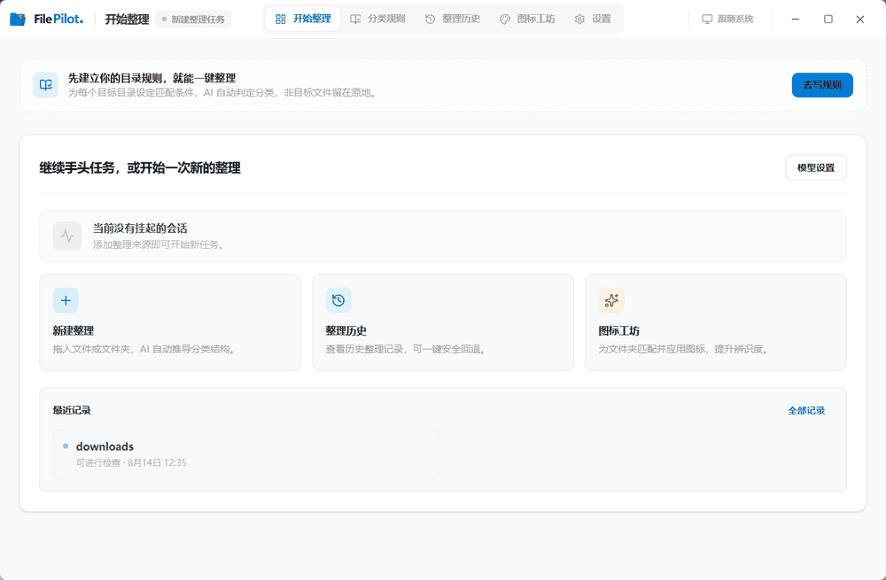

# FilePilot

FilePilot 是一款 Windows 文件整理工具。它使用你配置的模型分析文件，并根据整理方式生成或执行归档方案。




## 先选整理方式

| 方式 | 适合场景 | 流程 |
| --- | --- | --- |
| 普通整理 | 第一次整理，或每次规则都不同 | 选择来源 → 生成方案 → 检查并调整 → 预检 → 执行 |
| 一键整理 | 已经配置好分类规则的日常归档 | 选择来源和规则 → 自动扫描、规划、预检并执行 |

普通整理会在执行前停下来，展示每个文件的目标位置。一键整理不会停在方案确认页；未匹配或无法确定的文件会留在原处。

## 主要功能

- 将文件归入已有目录，或生成新的分类目录。
- 一次选择多个文件或文件夹作为任务来源。
- 为目标目录编写分类规则，并在之后重复用于一键整理。
- 在普通整理中调整方案，检查路径冲突、跨盘移动等执行前风险。
- 保存整理历史，查看执行记录并尝试回退最近一次整理。
- 使用图标工坊为文件夹生成、预览、应用和恢复自定义图标。

图标工坊是可选功能，需要单独配置图像模型。文件整理只需要文本模型。

## 安装与使用

目前提供 Windows 10/11 桌面版。前往 [GitHub Releases](https://github.com/qup1010/FilePilot/releases) 下载安装包。

首次启动后：

1. 打开设置，填写文本模型的接口地址、模型名称和 API Key，并测试连接。接口需要兼容 OpenAI Chat Completions API。
2. 根据上面的对照表选择普通整理或一键整理。
3. 完成整理后，在整理历史中查看结果；需要时尝试回退最近一次执行。

### 普通整理

选择来源文件或文件夹，再选择“归入现有目录”或“生成新的分类结构”。等待扫描和方案生成后，检查文件目标位置，必要时通过工作区调整方案；确认预检结果后执行。

### 一键整理

先进入“分类规则”，建立一套规则配置，为每个目标目录填写归档说明。规则全部填写完成后，在首页选择来源目录和规则配置，点击“一键整理”。该模式适合已经确认分类边界的下载目录、素材目录等日常归档。

首次使用建议先复制一份可丢弃的测试目录，确认模型输出、分类规则和回退流程符合预期后，再处理重要目录。

## 模型与数据

FilePilot 不提供托管模型服务，也不内置固定账号。你需要自行提供兼容 OpenAI Chat Completions API 的接口，例如 OpenAI、DeepSeek、Ollama 或其他兼容服务。

- 文件扫描、方案展示和实际文件操作在本机完成。
- 分析与规划通常会向你配置的模型接口发送文件名、目录结构，以及按需提取的内容片段或摘要；是否发送图片内容取决于你是否开启图片理解。
- API Key 保存在本地配置中，不会提交给 FilePilot 服务。接口调用产生的费用、日志留存和数据处理方式由模型服务商决定。
- 图片理解默认关闭。若开启图片理解或使用图标工坊，需要额外配置图像模型。

源码运行时可以参考 [`config.example.json`](./config.example.json) 和 [`.env.example`](./.env.example)。桌面版直接在设置页配置即可。

## 当前限制

| 项目 | 说明 |
| --- | --- |
| 平台 | 当前只提供 Windows 桌面版。 |
| 扫描 | 每次任务重新扫描来源，暂不提供差异扫描。 |
| 一键整理 | 使用前需要一套完整的分类规则；该模式不会停在方案确认页。 |
| 预检 | 会检查已知风险，但不能保证发现所有问题。普通整理仍需检查方案；一键整理前需确认规则和来源目录。 |
| 回退 | 只针对最近一次执行。文件被移动、修改或占用后，回退可能只能部分完成。 |
| 模型服务 | 分析速度和结果受模型能力、接口兼容性及服务稳定性影响。 |

## 从源码运行

需要：

- Python 3.11+
- Node.js 20+
- 可用的文本模型接口
- Rust 和 Windows C++ 编译工具（仅运行或打包 Tauri 桌面壳时需要）

以下命令在 PowerShell 中、项目根目录执行。

### 安装依赖

```powershell
python -m venv .venv
.venv\Scripts\Activate.ps1
pip install -r requirements.txt

npm --prefix frontend install
npm --prefix desktop install
```

### 启动桌面版

```powershell
npm --prefix desktop run tauri:dev
```

该命令会启动 Tauri、Next.js 前端和本地 Python 后端。桌面版使用运行时配置发现后端端口，不要求固定使用 `8765`。

### 只运行浏览器前端

分别打开两个终端，在项目根目录执行：

```powershell
python -m file_pilot.api
```

```powershell
npm --prefix frontend run dev
```

浏览器模式需要后端单独运行，默认 API 地址为 `http://127.0.0.1:8765`。如果该端口被占用，可以在两个终端分别设置同一个端口：

```powershell
# 终端 1
$env:FILE_PILOT_API_PORT = "8766"
python -m file_pilot.api

# 终端 2
$env:NEXT_PUBLIC_API_BASE_URL = "http://127.0.0.1:8766"
npm --prefix frontend run dev
```

### 启动异常时先看哪里

- 桌面版无法连接后端：检查 `output/runtime/backend.json` 是否生成，再查看 `logs/backend/runtime.log`。
- 一键整理按钮不可用：进入“分类规则”，补全当前规则配置中的每个目标目录说明。
- 浏览器前端显示连接错误：确认后端已经启动，并检查 `NEXT_PUBLIC_API_BASE_URL` 是否指向实际地址。

## 项目结构

| 目录 | 内容 |
| --- | --- |
| [`file_pilot/`](./file_pilot/) | Python 后端：扫描、模型调用、规划、预检、执行和回退 |
| [`frontend/`](./frontend/) | Next.js 工作台界面 |
| [`desktop/`](./desktop/) | Tauri 桌面壳与 Windows 原生能力 |
| [`tests/`](./tests/) | Python 测试 |
| [`design-docs/`](./design-docs/) | 功能和架构设计文档 |

前端和桌面宿主的开发约定见 [frontend/README.md](./frontend/README.md) 和 [desktop/README.md](./desktop/README.md)。

## 常用检查

```powershell
python -m unittest discover -s tests -p "test_*.py"
npm --prefix frontend run typecheck
```

修改前端交互时还可以运行 `npm --prefix frontend test`；修改桌面壳时，在 `desktop/src-tauri` 目录运行 `cargo check`。

## 许可证

[MIT](./LICENSE)
