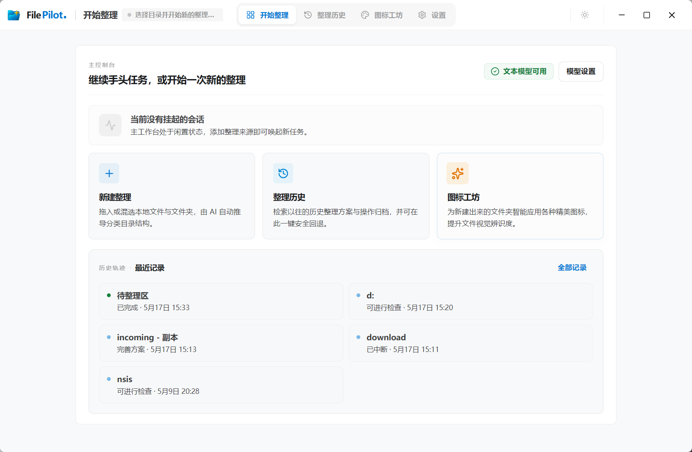
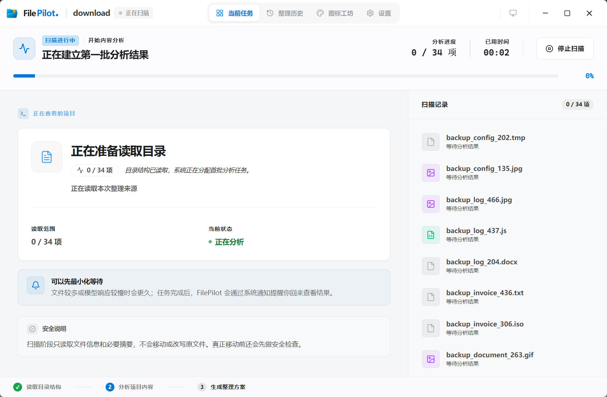
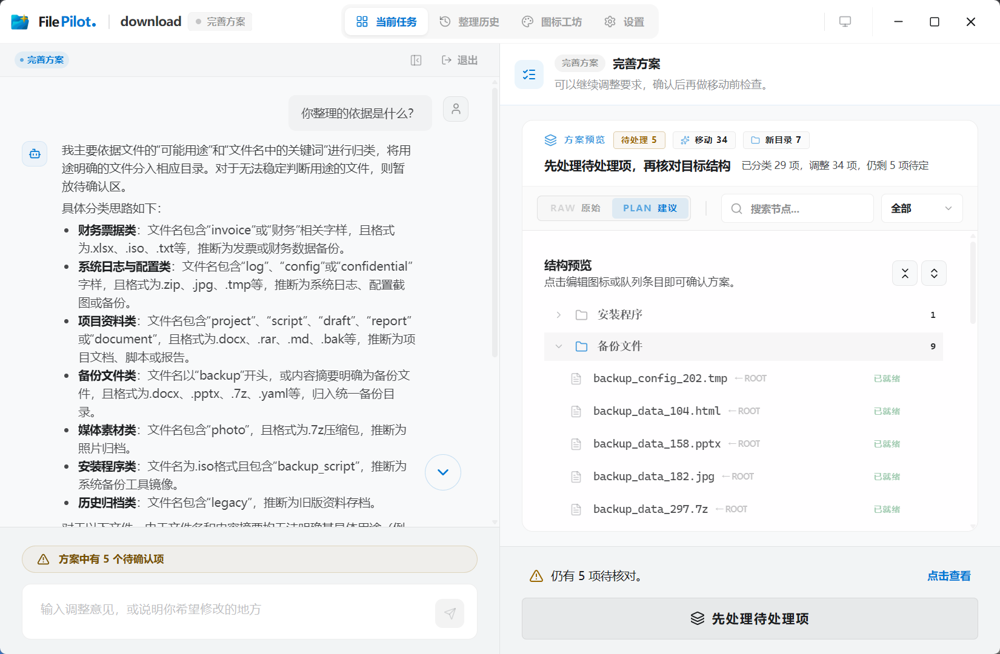

<div align="center">
  

  <h1>FilePilot</h1>

  <p>一个面向 Windows 的本地 AI 文件整理工作台</p>

  <p>
    
    
    
    
    
  </p>

  <p>
    <a href="#项目简介">项目简介</a> |
    <a href="#核心特性">核心特性</a> |
    <a href="#界面预览">界面预览</a> |
    <a href="#快速开始">快速开始</a> |
    <a href="#配置模型">配置模型</a> |
    <a href="#源码运行">源码运行</a> |
    <a href="#安全边界">安全边界</a> |
    <a href="#当前限制">当前限制</a> |
    <a href="#常见问题">常见问题</a>
  </p>
</div>

---

## 项目简介

FilePilot 是一个本地运行的 AI 文件整理工作台，主要用于整理 Windows 上长期堆积的下载目录、桌面目录、素材暂存目录和临时文件夹。

它不会直接替你“盲目移动文件”，而是把文件整理拆成一条可确认的工作流：先扫描来源目录，再由模型生成整理方案，随后进行执行前预检，最后由用户确认后再真正移动文件。执行完成后，FilePilot 会保留日志和最近一次回退入口，方便检查整理结果或撤销操作。

FilePilot 更适合处理“文件很多、类型混杂、命名不统一、人工整理成本高”的场景，例如下载目录、课程资料、截图素材、办公文档、临时收集文件等。

## 核心特性

### AI 辅助整理

FilePilot 可以基于文件名、目录结构和必要的内容摘要生成整理建议。你可以选择把文件归入已有目录，也可以让它生成新的分类结构。

### 执行前预检

在真正移动文件之前，FilePilot 会先展示整理方案，并对潜在风险进行提示，例如目标路径冲突、跨磁盘移动、异常任务状态等。用户需要确认后才会执行实际文件操作。

### 本地工作台体验

项目提供 Windows 桌面版，前端工作台负责新建任务、查看扫描进度、确认整理方案、管理历史记录和配置模型。桌面宿主负责启动本地后端、连接前后端运行时，并提供文件选择等原生能力。

### 可回退与可追踪

每次执行都会记录整理日志。整理完成后，可以查看历史记录，并使用最近一次回退入口撤销上一次整理操作。

### 模型接口由用户掌控

FilePilot 不提供托管模型服务，也不会内置固定模型账号。你需要自行配置 OpenAI-compatible 的模型接口，例如 OpenAI、DeepSeek、Ollama 或其他兼容服务。

### 可选图片理解与图标工坊

默认只需要配置文本模型即可使用主流程。图片理解是可选能力，可以关闭，也可以复用文本模型或单独配置视觉模型。

此外，FilePilot 还提供图标工坊，可为整理后的文件夹生成、预览、应用和恢复自定义图标。该功能需要额外配置生图模型。


## 适合使用的场景

FilePilot 适合用于整理下载目录、桌面文件、课程资料、文档素材、图片素材、临时收集文件夹等普通用户目录。

它不建议直接用于系统目录、同步盘根目录、正在开发的代码仓库、包含大量敏感信息的私有目录，或者任何你不希望发送给外部模型分析的文件集合。

## 界面预览

### 启动工作台

进入桌面版后，可以继续已有任务，也可以开始一次新的整理任务。



### 扫描与分析

扫描阶段会读取来源结构，并逐步建立分析结果。对于较大的任务，可以等待后台分析完成。



### 方案确认

整理方案生成后，可以在执行前查看结构预览、待处理项和确认入口。



## 快速开始


前往 [GitHub Releases](https://github.com/qup1010/FilePilot/releases) 下载最新版本，安装后打开 FilePilot，在设置页中配置文本模型接口，然后选择一个测试目录开始整理。

首次使用时，建议先复制一份小型测试目录，不要直接对重要目录执行整理。确认模型输出、整理方案和回退流程都符合预期后，再处理真实目录。

## 配置模型

FilePilot 使用 OpenAI-compatible 接口。你至少需要配置文本模型的接口地址、模型名称和 API Key。

源码运行时，可以复制 `config.example.json` 为 `config.json`，然后填写自己的配置：

```json
{
  "text_presets": {
    "default": {
      "name": "默认文本模型",
      "OPENAI_BASE_URL": "https://your-text-endpoint/v1",
      "OPENAI_MODEL": "your-model-name",
      "OPENAI_API_KEY": "your-api-key"
    }
  },
  "active_text_preset_id": "default"
}

```

只配置文本模型即可使用扫描、规划、预检、执行和回退主链路。图片理解默认关闭，不影响基础整理功能。


## 最小使用流程

1. 打开 FilePilot 桌面版。
2. 进入设置页，配置文本模型接口并测试连通性。
3. 选择一个测试目录作为来源。
4. 选择整理方式：归入已有目录，或生成新的分类结构。
5. 等待扫描和方案生成。
6. 检查整理方案和预检结果。
7. 确认无误后执行。
8. 在历史记录中查看执行日志，必要时使用最近一次回退。

## 安全边界

FilePilot 的工作台和文件执行逻辑在本地运行，但在扫描分析和规划阶段，文件名、目录结构以及必要的内容摘要可能会发送到你自己配置的模型接口。

这意味着你需要自行判断所选目录是否适合交给外部模型分析。对于敏感资料、商业项目、隐私文件、系统目录和同步盘根目录，建议不要直接使用 FilePilot 进行整理。

FilePilot 不代管你的 API Key，也不提供托管模型服务。模型调用的安全性、稳定性、费用和隐私边界取决于你选择的模型服务商。

## 当前限制

FilePilot 当前主要面向 Windows 桌面环境。

源码运行更适合开发者，普通用户建议使用 Release 中的桌面安装包。

执行前预检会提示潜在风险，但不会替用户自动阻断所有高成本或高风险操作。请在确认方案无误后再执行整理。

文件分析质量取决于你配置的模型能力、上下文窗口、接口稳定性以及待整理文件本身的信息量。


## 常见问题

### Codex、Claude Code 等 Agent 工具也能整理文件，FilePilot 有什么区别？

通用 Agent 确实可以通过命令行或脚本整理文件，但它更像一次临时对话，效果很依赖提示词和用户对命令行风险的理解。

FilePilot 更像一个专门为文件整理设计的桌面工具。它会先扫描文件，再生成整理方案，执行前展示预检结果，最后由用户确认后才移动文件。整理完成后还会保留日志和最近一次回退入口。

所以 FilePilot 的优势不是“比通用 Agent 更聪明”，而是流程更固定、操作更可视、风险更可控，也更适合不想自己写脚本的普通用户。

### 图标工坊和文件整理有什么关系？

图标工坊是 FilePilot 的扩展能力，不是整理文件的必要步骤。

文件整理解决的是“文件应该放到哪里”，图标工坊解决的是“整理后的目录怎么更容易识别”。当 FilePilot 生成新的分类目录后，用户可以继续为这些文件夹生成、预览、应用或恢复自定义图标，让整理后的目录更直观。


## 源码运行

### 1. 安装 Python 依赖

```bash
pip install -r requirements.txt
```

### 2. 安装前端依赖

```bash
cd frontend
npm install
```

### 3. 安装桌面端依赖

```bash
cd ../desktop
npm install
```

### 4. 启动本地 API

```bash
python -m file_pilot.api
```

默认地址：

```text
http://127.0.0.1:8765
```

### 5. 启动前端工作台

```bash
cd frontend
npm run dev
```

### 6. 启动桌面壳

需要本机已安装 Rust 环境。

```bash
cd desktop
npm run tauri:dev
```

**友情链接** · [**LINUX DO**](https://linux.do/)


## License

[MIT](./LICENSE)


