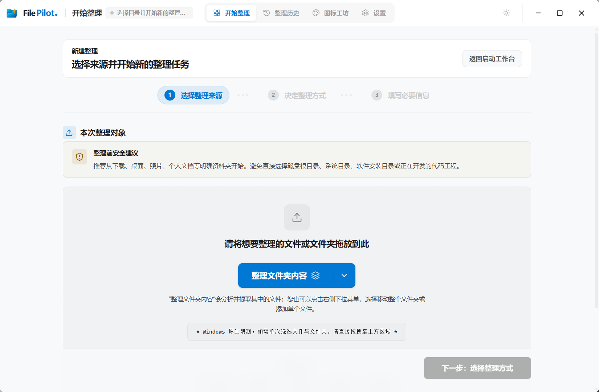
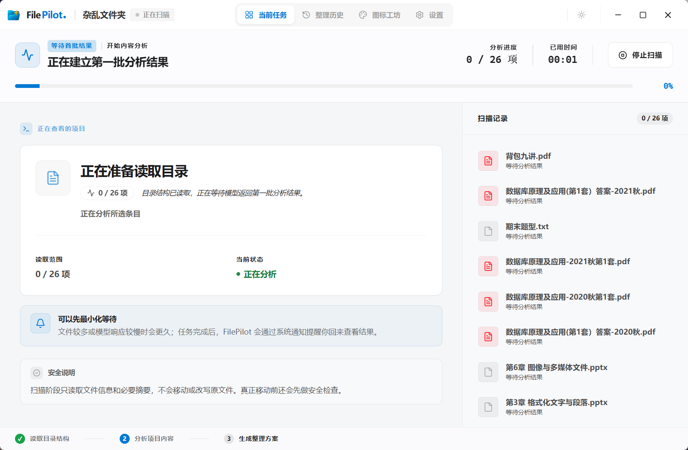
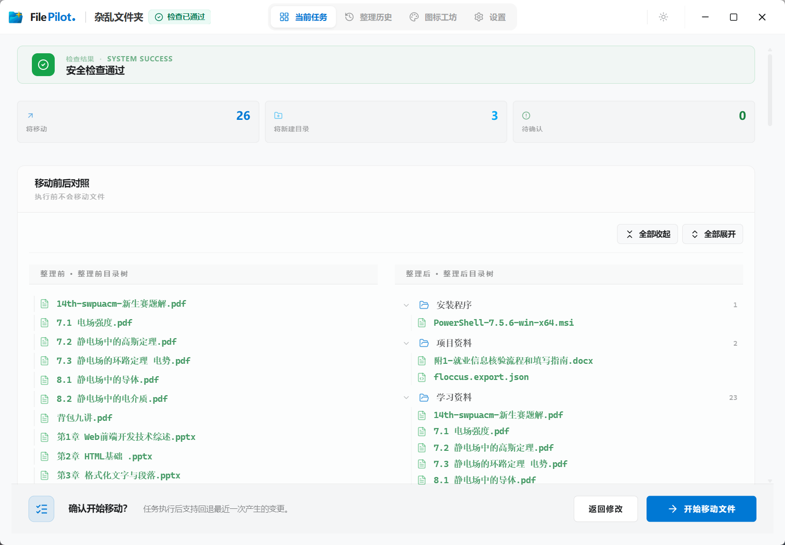
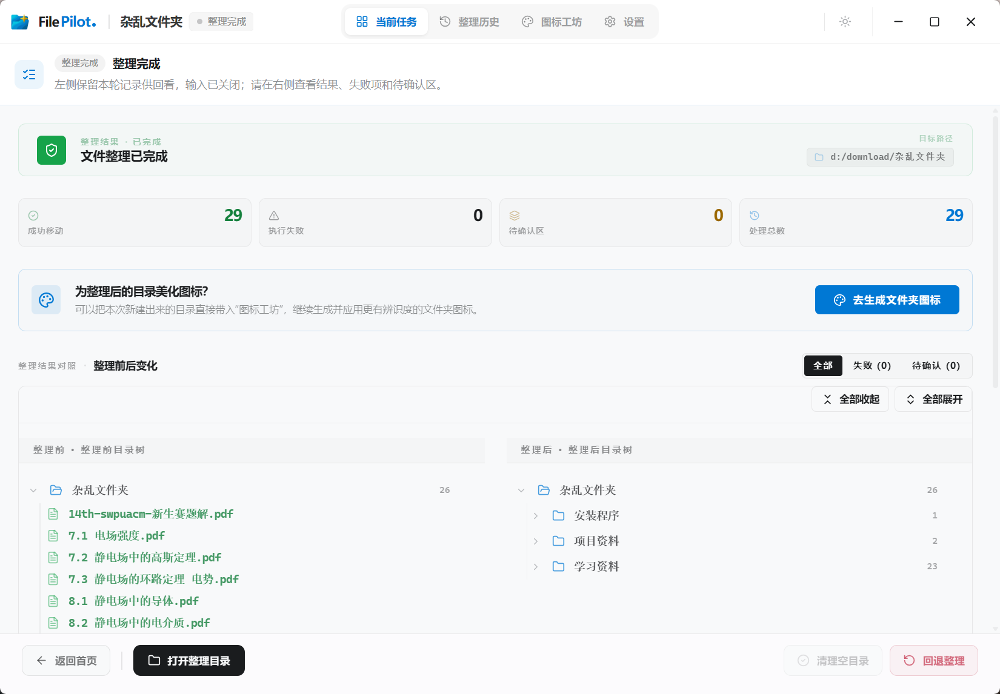
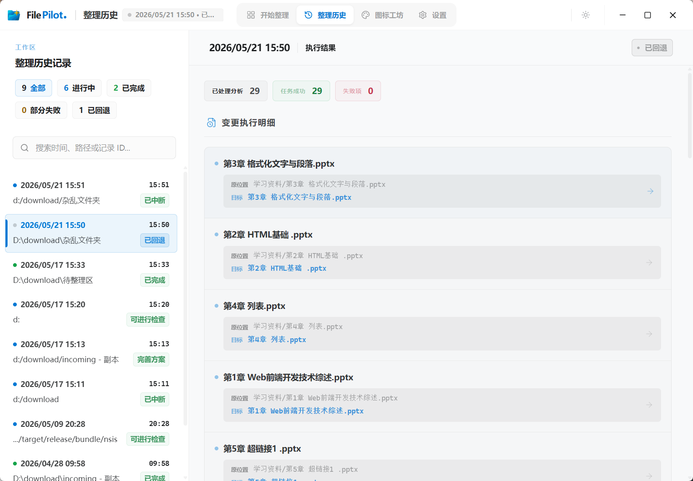

<div align="center">
  

  <h1>FilePilot</h1>

  <p>让 AI 帮你安全整理杂乱文件</p>

  <p>
    
    
    
    
    
  </p>

  <p>
    <a href="#项目简介">项目简介</a> |
    <a href="#核心特性">核心特性</a> |
    <a href="#界面预览">界面预览</a> |
    <a href="#快速开始">快速开始</a> |
    <a href="#配置模型">配置模型</a> |
    <a href="#项目架构">项目架构</a> |
    <a href="#设计概要">设计概要</a> |
    <a href="#源码运行">源码运行</a> |
    <a href="#参与贡献">参与贡献</a>
  </p>
</div>

---

## 项目简介

FilePilot 是一个本地运行的 AI 文件整理应用，能够帮助用户整理和归档各种杂乱文件。

它把文件整理拆成一条可确认的工作流：扫描来源 → 模型生成整理方案 → 执行前预检 → 用户确认后执行。每次执行都保留日志和回退入口，方便检查结果或撤销。

FilePilot 适合处理"文件很多、类型混杂、命名不统一、人工整理成本高"的场景，例如下载目录、课程资料、截图素材、办公文档、临时收集文件等。

<details>
<summary><b>为什么不直接使用通用 AI Agent（如 Claude Code 等）？</b></summary>

通用 Agent 通常将文件系统视为开发环境直接操作，并不适合面向日常大批量文件整理。FilePilot 针对该场景做了以下优化：

- **方案可视化与交互确认**：不仅提供图形界面，且在移动任何文件前都会生成结构化的整理方案供用户预览和微调，避免盲目执行。
- **预检与安全约束**：内置路径冲突和跨盘符移动等风险检查，且必须经用户手动确认才执行真实操作，每次整理均可一键回退。
- **阶段隔离**：将扫描、分析和规划拆分为独立阶段，避免长上下文下的信息丢失和幻觉，提高大批量文件处理的稳定性。
</details>

## 核心特性

### 把杂乱文件夹变成可确认的整理方案

FilePilot 可以基于文件名、目录结构和必要的内容摘要生成整理建议。你可以选择把文件归入已有目录，也可以让它生成新的分类结构。

### 移动前先检查风险，不让 AI 直接乱动文件

在真正移动文件之前，FilePilot 会先展示整理方案，并对潜在风险进行提示，例如目标路径冲突、跨磁盘移动、异常任务状态等。用户需要确认后才会执行实际文件操作。

### 整理后可查日志，操作可回退

每次执行都会记录整理日志。整理完成后，可以查看历史记录，并使用最近一次回退入口撤销上一次整理操作。

### 使用你自己的模型接口，不绑定托管服务

FilePilot 不提供托管模型服务，也不会内置固定模型账号。你需要自行配置 OpenAI-compatible 模型接口，例如 OpenAI、DeepSeek、Ollama 或其他兼容服务。

### 支持多个来源一起整理

可以同时选择多个文件或文件夹作为来源，合并到一次整理任务中一起处理。

### 整理后为文件夹生成更直观的图标

FilePilot 还提供图标工坊，可为整理后的文件夹生成、预览、应用和恢复自定义图标。该功能需要额外配置生图模型。

## 适用场景

| ✅ 适合 | ❌ 不建议 |
| :--- | :--- |
| 下载目录、桌面文件 | 系统目录 |
| 课程资料、文档素材 | 同步盘根目录 |
| 图片素材、临时收集文件夹 | 正在开发的代码仓库 |
| 命名不统一的混杂目录 | 含敏感信息的私有目录 |
| | 不希望发送给外部模型分析的文件 |

## 界面预览

FilePilot 采用桌面级工作台设计，界面信息密度高、操作反馈感强。以下为整理任务的核心阶段：

### 1. 任务创建与分流

支持单次混选文件/文件夹作为来源，并可决定去向为“归入已有目录”或“生成新的分类结构”，高级设置中可单独覆盖默认规则。

<p align="center">
  
  
</p>

### 2. 扫描与增量分析

扫描来源目录结构并逐步调用模型建立分析结果（包含用途判断和摘要）。大批量文件场景支持后台分批异步扫描。

<p align="center">
  
  
</p>

### 3. 方案确认与安全预检

模型根据分析结果给出结构化的整理建议。用户可与规划 Agent 对话调整方案。在执行前系统会运行多项安全预检并提示潜在风险。

<p align="center">
  
  
</p>

### 4. 结果记录与日志回退

执行整理后可查阅当前任务完成页。所有历史整理均会保留操作日志，并支持对最近一次的整理进行一键回退。

<p align="center">
  
  
</p>


## 快速开始

### 环境要求

- Windows 10 / 11
- 一个可用的 OpenAI-compatible 模型接口（如 OpenAI、DeepSeek、Ollama 等）

### 安装与首次使用

1. 前往 [GitHub Releases](https://github.com/qup1010/FilePilot/releases) 下载最新版本的安装包。
2. 安装后打开 FilePilot，进入设置页配置文本模型接口并测试连通性。
3. 选择一个测试目录作为来源。
4. 选择整理方式：归入已有目录，或生成新的分类结构。
5. 等待扫描和方案生成。
6. 检查整理方案和预检结果。
7. 确认无误后执行。
8. 在历史记录中查看执行日志，必要时使用最近一次回退。

> **首次使用建议**：先复制一份小型测试目录，不要直接对重要目录执行整理。确认模型输出、整理方案和回退流程都符合预期后，再处理真实目录。

## 配置模型

FilePilot 使用 OpenAI-compatible 接口。你至少需要配置文本模型的接口地址、模型名称和 API Key。

**桌面版用户**：打开应用后在设置页中配置即可，不需要手动编辑配置文件。

**源码运行**：复制 `config.example.json` 为 `config.json`。默认是空配置（未配置模型时字段为空，健康状态显示「待配置」），可在设置页填写，或直接编辑配置文件：

```json
{
  "text_presets": {
    "default": {
      "name": "默认文本模型",
      "OPENAI_BASE_URL": "https://api.openai.com/v1",
      "OPENAI_MODEL": "gpt-5.2",
      "OPENAI_API_KEY": "sk-..."
    }
  },
  "active_text_preset_id": "default"
}
```

也可以通过环境变量配置，参考 `.env.example` 中的字段说明。

只配置文本模型即可使用扫描、规划、预检、执行和回退主链路。图片理解默认关闭，不影响基础整理功能。

## 项目架构

```
FilePilot/
├── file_pilot/          # Python 后端（FastAPI）
│   ├── api/             #   本地 API 服务与运行时发现
│   ├── analysis/        #   扫描分析、文件读取、摘要
│   ├── organize/        #   整理对话、增量计划、确认逻辑
│   ├── execution/       #   执行计划、日志、报告
│   ├── rollback/        #   最近一次执行回退
│   └── app/             #   桌面工作台会话服务
├── frontend/            # Next.js 工作台前端
├── desktop/             # Tauri 桌面壳（Rust）
│   └── src-tauri/       #   后端子进程管理、原生命令、运行时注入
├── tests/               # Python 测试
└── config.json          # 模型与全局配置
```

三层职责：

- **Python 后端**：提供本地 API，负责文件扫描、模型调用、方案规划、预检和执行。通过 `output/runtime/backend.json` 暴露运行时地址。
- **Next.js 前端**：工作台界面，包括来源选择、方案预览、对话交互、历史记录和设置。
- **Tauri 桌面壳**：负责拉起后端进程、向前端注入运行时配置（`window.__FILE_PILOT_RUNTIME__`），以及提供目录选择、图标应用等原生能力。

前端既可以在浏览器中独立运行（需手动启动后端），也可以作为 Tauri 桌面应用的一部分运行（桌面壳自动管理后端生命周期）。

## 设计概要

以下是 FilePilot 在文件整理链路上的核心设计选择，面向想了解实现思路的开发者。

### 分析与规划分离（双 Agent）

文件整理拆成两个独立的模型调用阶段：

- **分析 Agent**：读取来源目录，为每个文件/文件夹生成用途判断和内容摘要。支持并发分批处理大目录，每批结果独立校验，失败的批次自动重试。
- **规划 Agent**：接收分析结果，生成整理方案（目标目录结构和文件映射）。通过对话交互支持用户修改方案。

两个阶段使用不同的系统提示和工具集，上下文互不干扰。分析阶段的输出是结构化的扫描信息，规划阶段以此为输入，不需要重新读取文件内容。

### 增量规划

规划 Agent 不直接输出完整的整理方案文本，而是通过工具调用提交增量变更。每次提交只包含本轮的变化：如更新文件的目标目录、目录重命名、待处理项的变化等。

系统在收到变更后校验合法性（文件是否在规划范围内、目标目录是否允许等），校验失败会自动构造反馈消息触发模型重试。用户也可以通过对话追加约束，系统会将用户消息和当前计划状态一起发给模型，生成下一轮变更。

这样做的好处是：模型每轮只需要处理变化部分，减少长上下文下的遗漏；用户可以逐步调整方案而不用每次重新生成。

### ID 映射

为了避免模型在处理大量文件时因文件名相似或重复而混淆，系统为每个来源文件分配一个短编号，在规划阶段使用编号作为操作键而不是文件名。

编号由分析阶段自动分配，在整个会话生命周期内保持稳定。模型的工具调用参数使用编号引用文件，系统负责将编号映射回真实路径。自然语言回复中会过滤掉这些内部编号，用户侧只看到文件的显示名称。

对于"归入已有目录"模式，目标目录也会分配槽位编号，模型通过编号引用目标，避免在长路径上出错。

## 当前限制

- 当前只提供 Windows 桌面版，不支持 macOS 和 Linux。
- 每次整理任务是全量扫描，不支持增量或差异整理。
- 文件分析速度和质量取决于你配置的模型能力、上下文窗口和接口稳定性。
- 执行前预检会提示潜在风险，但不会替用户自动阻断所有高成本或高风险操作。请在确认方案无误后再执行。
- 回退仅支持最近一次执行，不支持多次回退。

## 常见问题

### 图标工坊和文件整理有什么关系？

图标工坊是 FilePilot 的扩展能力，不是整理文件的必要步骤。

文件整理解决的是"文件应该放到哪里"，图标工坊解决的是"整理后的目录怎么更容易识别"。当 FilePilot 生成新的分类目录后，用户可以继续为这些文件夹生成、预览、应用或恢复自定义图标，让整理后的目录更直观。

### 支持哪些模型？

任何兼容 OpenAI Chat Completions API 的模型服务都可以使用，包括 OpenAI、DeepSeek、通义千问、Ollama 本地模型等。在设置页配置接口地址、模型名称和 API Key 后测试连通性即可。

### 文件内容会被发送到外部吗？

FilePilot 的主界面和文件执行逻辑完全在本地运行，但扫描和规划阶段需要向模型服务发送数据：
- **发送的数据**：系统会读取文件名、目录结构和必要的内容摘要（如文档标题、文本文档的前几页），并将这些信息发送给你配置的模型接口。原始大文件本身不会被上传。
- **隐私与安全**：FilePilot 不会代管你的 API Key，不收集任何用户凭证，也不提供托管模型服务。接口调用的数据传输安全、隐私边界及可能产生的费用完全取决于你所选择的模型服务商。

### 启动后连不上后端怎么办？

- 桌面版：检查 `output/runtime/backend.json` 是否已生成，查看 `logs/backend/runtime.log` 中的错误信息。
- 源码运行：确认 Python 虚拟环境已激活、依赖已安装，手动运行 `python -m file_pilot.api` 查看输出。

## 源码运行

以下命令均在项目根目录下执行。

### 环境要求

- Python 3.11+
- Node.js 18+
- Rust 环境（仅桌面壳需要，可通过 [rustup.rs](https://rustup.rs/) 安装）

### 1. 安装 Python 依赖

建议使用虚拟环境：

```powershell
python -m venv .venv
.venv\Scripts\Activate.ps1
pip install -r requirements.txt
```

### 2. 安装前端依赖

```powershell
cd frontend
npm install
```

### 3. 安装桌面端依赖

```powershell
cd ..\desktop
npm install
```

### 启动方式

有两种开发启动方式，按需选择：

**方式 A：桌面联调（推荐）**

在 `desktop/` 目录下执行：

```powershell
npm run tauri:dev
```

这条命令会自动拉起 Python 后端和 Next.js 前端，不需要手动启动其他进程。脚本会自动检测项目根目录的 `.venv` 虚拟环境。

**方式 B：纯前端开发**

分别在两个终端中启动后端和前端：

```powershell
# 终端 1：启动后端 API
python -m file_pilot.api
# 默认地址：http://127.0.0.1:8765
```

```powershell
# 终端 2：启动前端
cd frontend
npm run dev
```

这种方式不需要 Rust 环境，适合只修改前端或后端逻辑时使用。

## 参与贡献

欢迎提交 Issue 和 Pull Request。

提交代码前请确保通过以下检查：

```powershell
# Python 测试
python -m unittest discover -s tests -p "test_*.py"

# 前端类型检查
cd frontend && npm run typecheck

# Rust 编译检查（如果修改了桌面壳）
cd desktop\src-tauri && cargo check
```

## License

[MIT](./LICENSE)

---

**友情链接** · [**LINUX DO**](https://linux.do/)
